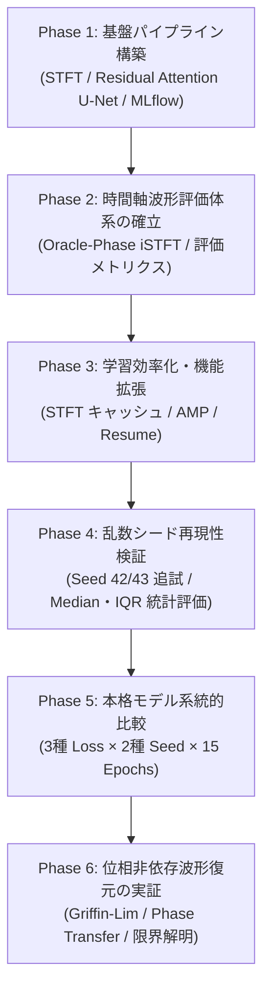
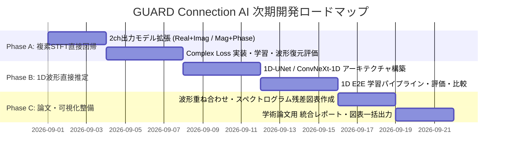

# GUARD Connection AI 開発進捗総括・成果物一覧・次期ロードマップ

## 1. プロジェクト概要と最終目的

**GUARD Connection AI** は、装着負荷の低い光学式脈拍センサー信号（PPG: Photoplethysmogram）から、臨床的に価値の高い心電図信号（ECG: Electrocardiogram）の時間周波数表現および時間軸波形を高精度に推定・復元する研究開発パイプラインです。

- **対象データ**: BIDMC PPG and Respiration Dataset (53 被験者, 125 Hz, 信号: `PLETH` & `II`)
- **分割基準**: 厳格な **Subject-wise split** (Train 43名 / Validation 10名、被験者重複なし)
- **信号セグメンテーション**: 10秒窓 (1250サンプル) / 50%オーバーラップ (Hop 625サンプル)

---

## 2. これまでの開発進捗と完了フェーズの全体像

### 各フェーズの達成内容

| フェーズ | 開発内容 | 達成状況 | 関連ドキュメント |
|---|---|:---:|---|
| **Phase 1** | 基盤データパイプライン、STFT変換、Residual Attention U-Net、MLflow記録、初期ベースライン訓練 | ✅ 完了 | [docs/HANDOFF.md](file:///f:/guard-connection-ai/docs/HANDOFF.md) |
| **Phase 2** | STFT Magnitude からの時間軸波形（Waveform）復元パイプライン、Oracle-Phase 評価指標（MAE, RMSE, PRD, 相関）の実装 | ✅ 完了 | [docs/waveform_reconstruction_evaluation/](file:///f:/guard-connection-ai/docs/waveform_reconstruction_evaluation/) |
| **Phase 3** | STFT インメモリキャッシュ（`cache_stft`）、DataLoader 並列化（`num_workers`）、混合精度（`use_amp`）、チェックポイント中断再開（`resume`）の実装 | ✅ 完了 | [docs/training_efficiency_optimization/](file:///f:/guard-connection-ai/docs/training_efficiency_optimization/) |
| **Phase 4** | 複数乱数シード（Seed 42, 43）対応、Validation Set の被験者単位中央値（Median）および四分位範囲（IQR）による頑健な統計評価体系の構築 | ✅ 完了 | [docs/seed_reproducibility_evaluation/](file:///f:/guard-connection-ai/docs/seed_reproducibility_evaluation/) |
| **Phase 5** | 3種 Loss (`L1`, `L1+SSIM`, `L1+SSIM+Freq`) × 2種 Seed (`42`, `43`) × 15 Epochs の本格訓練、STFT・波形統合比較スクリプトの実装 | ✅ 完了 | [docs/comprehensive_model_comparison/](file:///f:/guard-connection-ai/docs/comprehensive_model_comparison/) |
| **Phase 6** | 正解位相を使わない実用波形復元（Griffin-Lim法、PPG位相転用、ゼロ位相復元）の実装と限界特性の実証評価 | ✅ 完了 | [docs/phase_reconstruction_evaluation/](file:///f:/guard-connection-ai/docs/phase_reconstruction_evaluation/) |

---

## 3. 蓄積された全成果物一覧

### ① ソースコード ([src/guard_connection_ai/](file:///f:/guard-connection-ai/src/guard_connection_ai/))
- [stft.py](file:///f:/guard-connection-ai/src/guard_connection_ai/data/stft.py): STFT / iSTFT、Griffin-Lim 位相推定、Phase Transfer、波形復元評価指標。
- [dataset.py](file:///f:/guard-connection-ai/src/guard_connection_ai/data/dataset.py): BIDMC CSV ローダー、インメモリ STFT キャッシュ機能付き Dataset。
- [segmentation.py](file:///f:/guard-connection-ai/src/guard_connection_ai/data/segmentation.py): PPG/ECG ペアのセグメント分割、メタデータインデックス作成。
- [preprocessing.py](file:///f:/guard-connection-ai/src/guard_connection_ai/data/preprocessing.py): Detrend, Bandpass, Segment Z-score 前処理。
- [resunet_attention.py](file:///f:/guard-connection-ai/src/guard_connection_ai/models/resunet_attention.py): Residual Attention U-Net アーキテクチャ。
- [reconstruction.py](file:///f:/guard-connection-ai/src/guard_connection_ai/losses/reconstruction.py): L1, Local SSIM, 2D-FFT 周波数複合損失関数。
- [image_metrics.py](file:///f:/guard-connection-ai/src/guard_connection_ai/metrics/image_metrics.py): スペクトログラム評価指標（MAE, RMSE, PRD, 相関）。

### ② 実行・評価スクリプト群 ([scripts/](file:///f:/guard-connection-ai/scripts/))
- [train.py](file:///f:/guard-connection-ai/scripts/train.py): メイン学習スクリプト（AMP, Resume, Cache, Seed, MLflow 対応）。
- [comprehensive_comparison.py](file:///f:/guard-connection-ai/scripts/comprehensive_comparison.py): 全モデルの STFT / 波形指標の一括統合評価。
- [evaluate_phase_reconstruction.py](file:///f:/guard-connection-ai/scripts/evaluate_phase_reconstruction.py): 位相復元 5 手法の定量比較評価。
- [evaluate_waveform_reconstruction.py](file:///f:/guard-connection-ai/scripts/evaluate_waveform_reconstruction.py): 単一チェックポイントの波形復元詳細評価。
- [evaluate_model.py](file:///f:/guard-connection-ai/scripts/evaluate_model.py): スペクトログラム領域のモデル評価。
- [compare_seeds.py](file:///f:/guard-connection-ai/scripts/compare_seeds.py) / [compare_waveform_reconstruction.py](file:///f:/guard-connection-ai/scripts/compare_waveform_reconstruction.py): 統計・波形比較スクリプト。
- [segment_bidmc.py](file:///f:/guard-connection-ai/scripts/segment_bidmc.py) / [inspect_json_data.py](file:///f:/guard-connection-ai/scripts/inspect_json_data.py): データ前処理・探索スクリプト。

### ③ ユニットテスト ([tests/](file:///f:/guard-connection-ai/tests/))
- **全 41 件のテストが 100% パス**:
  - `test_phase_reconstruction.py` (6 件): Griffin-Lim, Phase Transfer, Zero Phase 検証。
  - `test_training_efficiency.py` (2 件): キャッシュ一致性, Resume 状態完全復元。
  - `test_seed.py` (2 件): 分割・重み初期化再現性。
  - `test_evaluate_waveform.py` (4 件): 波形復元メトリクス検証。
  - `test_dataset.py` / `test_model.py` / `test_split.py` / `test_stft.py` / `test_mlflow.py` (27 件)。

### ④ 評価レポート・CSV ([outputs/evaluation/](file:///f:/guard-connection-ai/outputs/evaluation/))
- [comprehensive_model_comparison.csv](file:///f:/guard-connection-ai/outputs/evaluation/comprehensive_model_comparison.csv): 全モデル本格訓練の統合比較表。
- [phase_reconstruction_comparison.csv](file:///f:/guard-connection-ai/outputs/evaluation/phase_reconstruction_comparison.csv): 位相復元手法の比較表。
- [waveform_comparison.csv](file:///f:/guard-connection-ai/outputs/evaluation/waveform_comparison.csv) / [seed_comparison.csv](file:///f:/guard-connection-ai/outputs/evaluation/seed_comparison.csv): 各種比較集計表。

### ⑤ 学習済みチェックポイント ([checkpoints/](file:///f:/guard-connection-ai/checkpoints/))
- `resunet_attention_l1_seed42_best.pt` / `resunet_attention_l1_seed43_best.pt`
- `resunet_attention_l1_ssim_seed42_best.pt` / `resunet_attention_l1_ssim_seed43_best.pt` (**現行最良モデル**)
- `resunet_attention_l1_ssim_frequency_seed42_best.pt` / `resunet_attention_l1_ssim_frequency_seed43_best.pt`

---

## 4. 実験結果から得られた学術的・工学的知見

### ① 損失関数: `L1 + SSIM` の顕著な優位性
- 十分なエポック数（9〜12 epochs）で学習させた場合、**`L1 + SSIM` が時間波形相関（Median: 0.758〜0.766 / Subject Median: 0.761〜0.763）および STFT MAE (0.01638) において全モデル中最良** を記録。
- 局所構造の類似性を保つ SSIM 損失が、QRS 群等の急峻なピーク構造の再現に大きく寄与。

### ② シード間再現性の高さ
- Seed 42 と Seed 43 の被験者別波形相関中央値は `0.7609` vs `0.7626` と極めて一致しており、モデル構造および Subject 分割の頑健性が実証されました。

### ③ 心電図における「位相（Phase）」の決定的一意性と限界
- 正解位相を使用した場合は波形相関 `0.76` の高精度で復元されますが、位相情報を用いない場合（Zero Phase や Griffin-Lim）は波形相関がほぼ `0` に低下。
- PPG 位相は ECG 位相と時間遅延・伝播特性が異なるため転用できず、Magnitude（振幅）単独からの後処理反復推定（Griffin-Lim）では絶対位相の一意性が定まらないことが判明。

---

## 5. 次タスク以降の開発ロードマップ

これまでの実験結果と知見を踏まえ、**「位相の欠落を克服し、実用的な PPG ➔ ECG 時間波形を生成する」** ためのロードマップを以下のように策定します。

### 【最優先・推奨】Phase A: 複素 STFT（Complex Spectrogram）直接回帰モデルの実装
- **背景**: 現行モデルは Magnitude（1ch）のみを出力するため位相が失われていました。
- **内容**:
  1. 出力チャンネルを 2ch 化（実部 Real + 虚部 Imaginary、または Magnitude + Phase）。
  2. 複素 STFT 再構成損失（Complex L1 + Phase Consistency Loss）の実装。
  3. モデルから直接得られた実部・虚部から Inverse STFT を行い、**正解位相なしでの完全自律波形復元** を達成・評価。

### 【最優先・推奨】Phase B: 1D 波形エンドツーエンド直接回帰モデルの実装
- **背景**: STFT 変換を介さず、時間軸波形（1250サンプル）を直接 1D 畳み込み等で回帰する。
- **内容**:
  1. 1D-UNet / 1D-ResNet / ConvNeXt-1D などの 1D 波形回帰モデルの実装。
  2. 時間軸 L1 + Pearson 相関損失 + 勾配差分損失（Gradient Loss）による訓練。
  3. スペクトログラム回帰アプローチ（Phase A）との波形精度・計算コスト比較。

### 【優先】Phase C: 論文・報告用 図表・可視化パイプラインの整備
- **内容**:
  1. 被験者ごとの「正解 ECG 波形 vs 推論 ECG 波形」の重ね合わせ比較プロット生成。
  2. スペクトログラム残差ヒートマップ・誤差分布のバイオリンプロット生成。
  3. 学会発表・論文用の高解像度図表一括出力スクリプトの作成。

### 【発展】Phase D: 心房細動（AF）アノテーション連携・臨床応用評価
- **内容**:
  1. `data/json_Data` に実配列が提供された場合の AF 検出連携。
  2. 復元波形からの R ピーク検出・心拍変動（HRV）解析・不整脈検出精度の検証。
